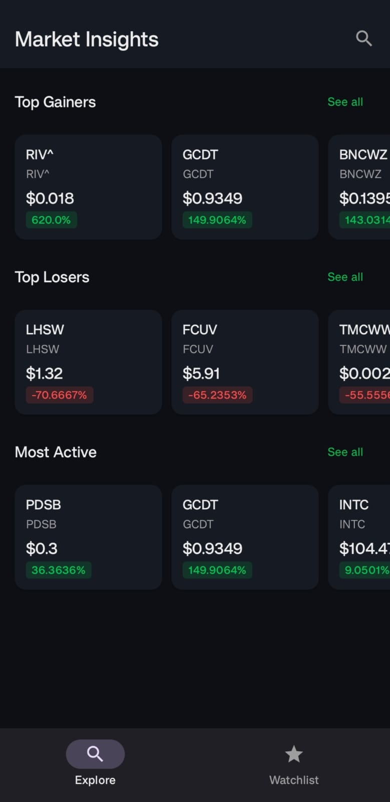
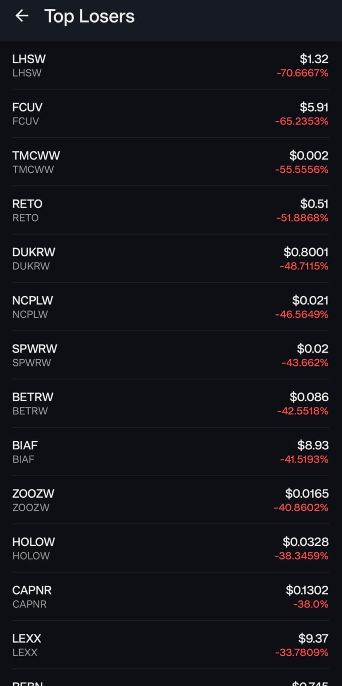
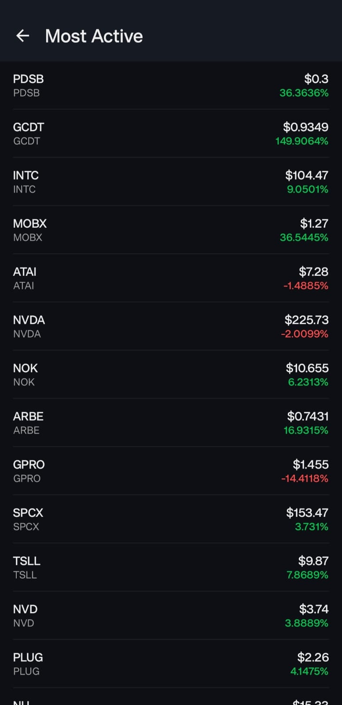

# StockMarketInsights

StockMarketInsights is a modern Android application built with Jetpack Compose that provides real-time market data, including top gainers, losers, and most active stocks. Users can search for stocks, view detailed insights, and manage their personal watchlists.

## 📸 Screenshots

| Explore Screen | Top Gainers |
| :---: | :---: |
|  |  |

| Top Losers | Most Active |
| :---: | :---: |
|  |  |

## ✨ Features

- **Market Overview:** Stay updated with Top Gainers, Top Losers, and Most Active stocks on the Explore screen.
- **Stock Search:** Easily find any stock by its symbol or name.
- **Detailed Insights:** View real-time price, changes, volume, and historical data charts for individual stocks.
- **Watchlists:** Create multiple custom watchlists to track your favorite stocks.
- **Offline Support:** Local caching using Room database ensures you can view previously fetched data even without an internet connection.
- **Modern UI:** Built entirely with Jetpack Compose and Material 3 for a sleek, responsive user experience.

## 🛠 Tech Stack

- **UI:** [Jetpack Compose](https://developer.android.com/jetpack/compose) (Material 3)
- **Networking:** [Retrofit](https://square.github.io/retrofit/) & OkHttp
- **Database:** [Room](https://developer.android.com/training/data-storage/room) for local caching
- **Navigation:** [Compose Navigation](https://developer.android.com/jetpack/compose/navigation)
- **Asynchronous Programming:** Kotlin Coroutines & Flow
- **Charts:** [MPAndroidChart](https://github.com/PhilJay/MPAndroidChart)
- **Image Loading:** [Glide](https://github.com/bumptech.glide/glide)
- **Data Parsing:** OpenCSV

## 🚀 Getting Started

### Prerequisites

- Android Studio Koala or newer.
- An API Key from [Alpha Vantage](https://www.alphavantage.co/support/#api-key).

### Installation

1. Clone the repository:
   ```bash
   git clone https://github.com/yourusername/StockMarketInsights.git
   ```
2. Open the project in Android Studio.
3. Add your Alpha Vantage API Key to `local.properties`:
   ```properties
   ALPHA_VANTAGE_API_KEY=your_api_key_here
   ```
4. Sync Gradle and run the app.

## 📂 Project Structure

- `componentsUi/`: Reusable UI components (Cards, Status messages, etc.).
- `screensUi/`: Main screen composables.
- `viewmodel/`: Architecture components for managing UI state and data logic.
- `repository/`: Data layer for handling API calls and database operations.
- `roomdb/`: Room database configuration and DAOs.
- `network/`: Retrofit service interfaces and network models.
- `navigation/`: Navigation graph and route definitions.

## 📄 License

This project is licensed under the MIT License - see the [LICENSE](LICENSE) file for details.
